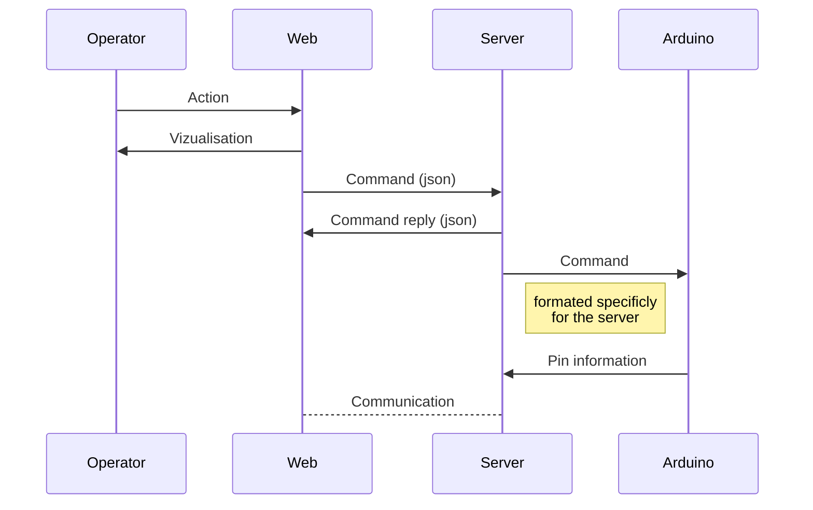

# Arduino Command

**Arduino command** is a project of serveur and web based application made for control your arduino project easely connected to a pc 

# Possibility

 - Control arduino with web interface.
 - Multiple arduino control.
 - Servomotor configuration and control.
 - LED Strip configuration and control.
 - PIN Analogue and digital control.
 - Create Animation of mouvement.
 - Command arduino with speech recognition.

## How it work

